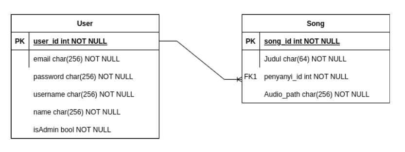

# Stupefy REST Service

# Quick Start
1. build 
```
docker-compose build
```
2. up 
```
docker-compose up -d
```
3. up production
```
docker-compose -f docker-compose.yml -f docker-compose.prod.yml up --build
```
4. down 
```
docker-compose down
```
5. migrate 
```
docker exec -it stupefy-rest-service-server-1 npx prisma migrate dev
```
6. seed 
```
docker exec -it stupefy-rest-service-server-1 npx prisma db seed
```

## Tugas Besar 2 - IF3110 Pengembangan Perangkat Lunak Berbasis Web<br>
Pengembangan aplikasi berbasis web dengan arsitektur *microservice*

## Author
- Ahmad Romy Zahran (13520009)
- Firizky Ardiansyah (13520095)
- Muhammad Fahmi Irfan (13520152)
  
## 1. Penjelasan Singkat
Stupefy REST service merupakan elemen *backend* dari service stupefy yang menyediakan endpoint untuk diambil oleh service lain. Adapun fitur yang diimplementasikan dalam service ini adalah endpoint untuk melakukan autentikasi, pengelolaan *song*, dan pengelolaan *singer*.


## 2. Requirements
1. Docker
2. NodeJS
3. Prisma

## 3. Cara Instalasi
1. Clone/Download repository ini.
2. Buatlah file ```.env``` pada root folder, salin field yang perlu diisi dari .env.example (jika sudah terisi, tidak perlu di ubah).
3. Jalankan ```docker compose build```
4. Tunggu hingga semua image berhasil di-*pull*.

## 4. Cara Menjalankan Server 
1. Untuk menjalankan server lakukan dengan perintah
    ```
    docker-compose up -d
    ```
2. Lakukan migrasi dengan menjalankan
```
docker exec -it stupefy-rest-service-server-1 npx prisma migrate dev
```
3. Lakukan seeding dengan menjalankan
```
docker exec -it stupefy-rest-service-server-1 npx prisma db seed
```
1. Server akan listen pada ```localhost:3100```

## 5. Skema Basis Data


## 6. Pembagian Tugas
| Fitur  | 13520009 | 13520095 | 13520152 |
| --- | --- | --- | --- |
| Login |  | :white_check_mark: |  |
| Register   |  | :white_check_mark: |  |
| Authorization   |  | :white_check_mark: |  |
| Song Controller   |  | :white_check_mark: |  |
| Singer Controller   |  | :white_check_mark: | :white_check_mark: |
| Subscription Request Controller   | :white_check_mark: |  |  |
| Database   |  | :white_check_mark: |  |

